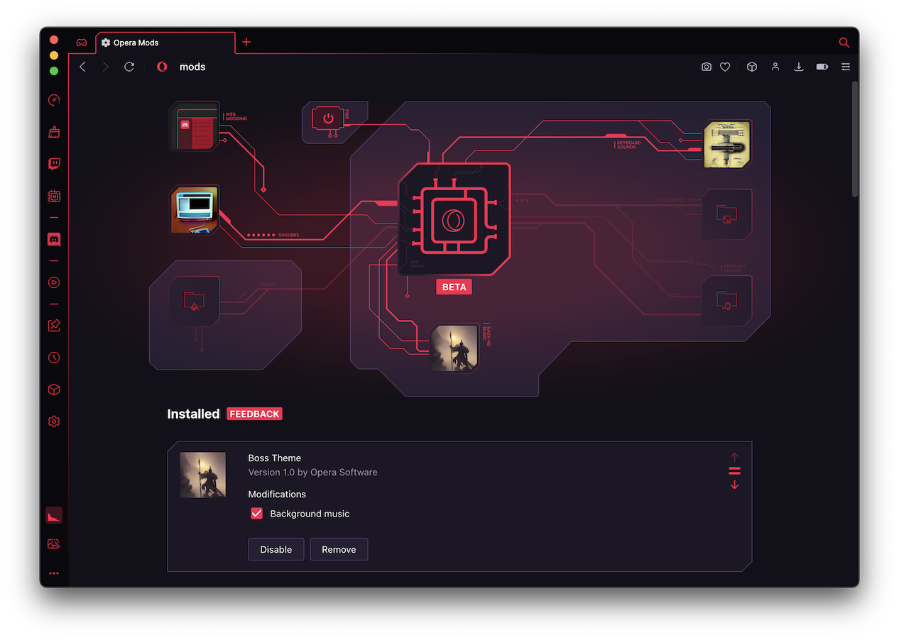

# What are Opera GX Mods?

GX Mods are a collection of customizations that allow users to create unique browsing experiences within Opera GX. With GX Mods, users can modify the browser's appearance, sounds, music, theme, wallpaper and even web content using web modding and shaders.

Users can install multiple mods and choose which elements to enable, giving them full control over the desired final effect.

## What can be done with mods?

With mod customization, authors have complete control over what is included and how deep the modifications go. Mods can range in modifications from small keyboard sound packs to *Mega Mods* that incorporate all possible changes.

The following areas provide ample opportunities to unleash creativity:

1. Background music - dynamic music that fits browsing
2. Keyboard sounds - mechanical keyboard, typewriter, or sci-fi terminal sounds
3. Browser sounds - opening and closing tabs, clicking, flipping switches, etc.
4. Wallpaper - light and dark versions (static and animated)
5. Theme - color theme for light and dark mode
6. Web modding - tuning web pages to create unique appearances
7. Shaders - applying visual effects to the whole screen while browsing.

## How to load sample mods?

As a quick start you can try some of the [sample mods](mods) provided.

1. Open Extensions view (opera:extensions)
2. Enable Developer mode in top right corner
3. Click Load unpacked and point to directory with manifest.json
4. Loaded mod will shown in Mods view (opera:mods)

## How to create mods?

[Documentation](documentation/mods.md)

## How to build and share mod?

1. Open extensions view (opera:extensions)
2. Enable Developer mode in top right corner
3. Click Pack extension and point to directory with manifest.json

This will produce .CRX file that you can share with friends. Drag and drop it into Opera GX to install that mod.

## Will there be a store?

Yes.

