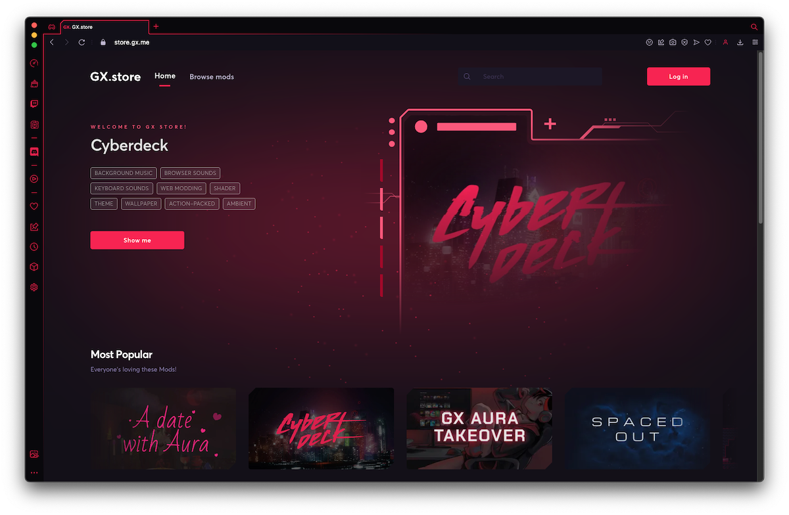

# What are Opera GX Mods?

GX Mods are a collection of customizations that allow users to create unique browsing experiences within Opera GX. With GX Mods, users can modify the browser's appearance, sounds, music, theme, wallpaper and even web content using web modding and shaders.

Users can install multiple mods and choose which elements to enable, giving them full control over the desired final effect.

## What can be done with mods?

With mod customization, authors have complete control over what is included and how deep the modifications go. Mods can range in modifications from small keyboard sound packs to *Mega Mods* that incorporate all possible changes.

The following areas provide ample opportunities to unleash creativity:

1. Background music - dynamic music that fits browsing
2. Keyboard sounds - mechanical keyboard, typewriter, or sci-fi terminal sounds
3. Browser sounds - opening and closing tabs, clicking, flipping switches, etc.
4. Wallpaper - light and dark versions (static and animated)
5. Theme - color theme for light and dark mode
6. Web modding - tuning web pages to create unique appearances
7. Shaders - applying visual effects to the whole screen while browsing.

## How to create mods?

1. Try [sample mods](mods) to see what's possible.
2. Use [Mod_Template](documentation/Mod_Template) as starting point.
3. Read [documentation](documentation/mods.md) to improve it.
3. Follow [guildelines](documentation/guidelines.md) to make it even better.
4. Upload to [GX.store](https://operagx.gg/mods2) via [GX.create](https://create.gx.games/mods). 

Bonus: You can use this [Figma template](https://github.com/opera-gaming/gxmods/raw/main/documentation/GXStoreFigmaTemplate.fig.zip) to create good looking images for [GX.store](https://operagx.gg/mods2).

### How to load sample mods?

1. Open _Extensions view_ (opera:extensions)
2. Enable _Developer mode_ in top right corner
3. Click _Load unpacked_ and point to directory with manifest.json
4. Loaded mod will shown in _Mods view_ (opera:mods)

### How to build and share mod?

There are two options. Building mod locally and sharing:

1. Open _extensions view_ (opera:extensions)
2. Enable _Developer mode_ in top right corner
3. Click _Pack extension_ and point to directory with manifest.json

This will produce .CRX file that you can share with friends. Drag and drop it into Opera GX to install that mod.

Or uploading zipped mod to [GX.store](https://operagx.gg/mods2) via [GX.create](https://create.gx.games/mods).

## Is there a store?

Yes. It's called [GX.store](https://operagx.gg/mods2) and you can upload mods that you created via [GX.create](https://create.gx.games/mods).

